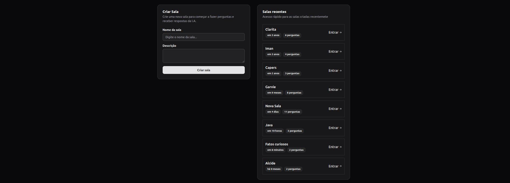
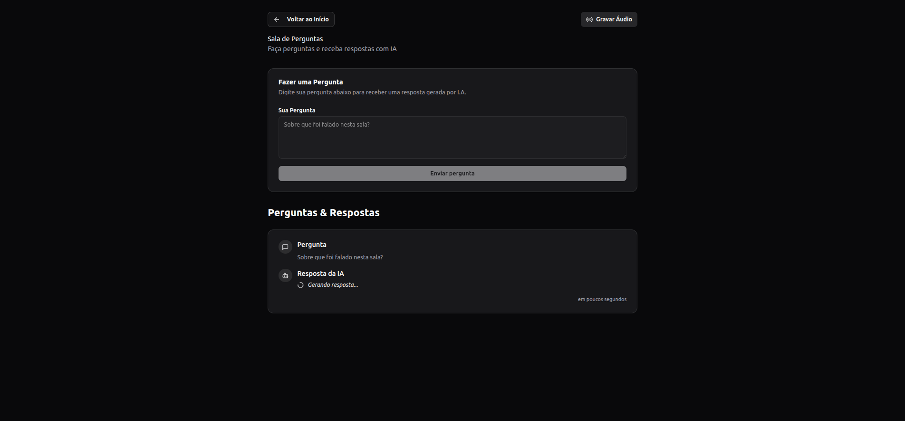
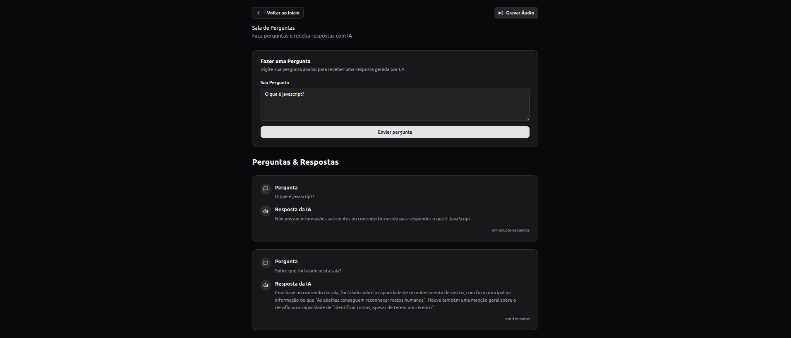

# Agents Web

O **Agents Web** permite criar salas para gravação de áudios e realizar perguntas que são respondidas por IA com base no conteúdo gravado.

O projeto server(backend) pode ser encontrado **[aqui](https://github.com/MarcosWinicios/agents-server)**.

## Tecnologias

## Tecnologias e Bibliotecas Utilizadas

- **[React](https://react.dev/)** – Construção de interfaces declarativas e reativas.
- **[React Router](https://reactrouter.com/)** e **React Hook Form** – Gerenciamento de rotas e formulários.
- **[TanStack Query](https://tanstack.com/query/latest)** – Gerenciamento de dados assíncronos.
- **[Zod](https://zod.dev/)** – Validação e tipagem de dados.
- **[Tailwind CSS](https://tailwindcss.com/)** – Estilização utilitária com animações e variantes.
- **[Vite](https://vitejs.dev/)** – Empacotador rápido para desenvolvimento frontend.
- **[TypeScript](https://www.typescriptlang.org/)** – Tipagem estática para JavaScript.
- **[Radix UI](https://www.radix-ui.com/)** – Componentes acessíveis e utilitários de composição.
- **[Day.js](https://day.js.org/)** – Manipulação de datas de forma leve.
- **[Lucide](https://lucide.dev/)** – Ícones para aplicações React.
- **[Biome](https://biomejs.dev/)** – Linter e formatter para manter qualidade do código.

## Configuração do Projeto

### Pré-requisitos

- Node.js (versão 18 ou superior)
- npm ou yarn

### Instalação

1. Clone o repositório
2. Instale as dependências:

   ```bash
   npm install
   ```

3. Execute o servidor de desenvolvimento:

   ```bash
   npm run dev
   ```

4. Acesse a aplicação em `http://localhost:5173`

### Scripts Disponíveis

- `npm run dev` - Inicia o servidor de desenvolvimento
- `npm run build` - Gera build de produção
- `npm run preview` - Preview do build de produção

### Telas

- Página inicial
  
- Detalhes de uma sala
  
  
- Gravar áudio
  

### Backend

O projeto consome uma API que deve estar rodando na porta 3333. Certifique-se de que o backend esteja configurado e executando antes de iniciar o frontend. O projeto backend está disponível **[aqui](https://github.com/MarcosWinicios/agents-server)**.

---

Projeto desenvolvido durante um evento da **Rocketseat**.
